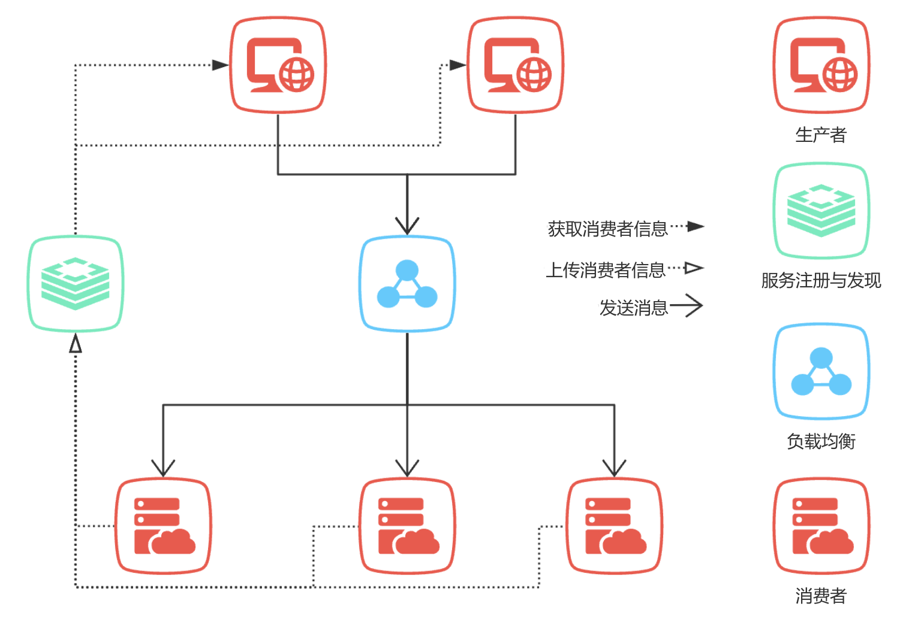

# Omipc 分布式异步通信框架
作者：stormi-li

Email：2785782829@qq.com

## 简介
当前实现异步通信的主流方式是消息队列中间件，其中消息队列承担的功能是缓冲流量，平衡系统负载，中间件承担的功能是实现系统间的减耦。但是在当前的微服务架构中，服务注册与发现系统能够承担系统间的减耦功能，而消息队列本身有多种实现形式，并不局限于中间件的形式。因此本人基于服务注册与发现的理念以及点对点消息传递的思想，设计了 Opmic 分布式异步通信框架。
## 贡献
* 消费者本身作为一个消息队列接入服务注册与发现系统
* 生产者通过服务注册与发现系统发现消费者，并与消费者建立点对点连接，实现生产消费
* 支持负载均衡，动态扩容
* 支持 Pub/Sub 
* 支持分布式锁（看门狗，锁ID，阻塞，唤醒）
* 所有功能基于 Redis 实现，没有引入新的技术栈，没有引入新的中间件，不会增加系统复杂度。
## 架构图

在该架构中，所有消费者作为消息队列本身在服务注册与发现组件上注册，由于消费者本身是去中心化的，因此它可以动态增加。生产者可以在服务注册与发现组件中通过队列名找到所有消费者，随后通过负载均衡策略与消费者建立点对点连接，由于生产者是直接与消费者建立连接，因此其吞吐量远远大于传统的消息队列中间件。
## 快速开始
### 安装
```shell
go get github.com/stormi-li/omipc-v1
```
### 创建消费者
```go
package main

import (
	"fmt"

	"github.com/go-redis/redis/v8"
	"github.com/stormi-li/omipc-v1"
)

func main() {
	c := omipc.NewClient(&redis.Options{Addr: "localhost:6379"})
	consumer := c.NewConsumer("queue_demo", 100000, 1)
	consumer.ListenAndConsume("localhost:5555", func(message []byte) {
		fmt.Println(string(message))
	})
}
```
### 创建生产者
```go
package main

import (
	"fmt"
	"strconv"
	"time"

	"github.com/go-redis/redis/v8"
	"github.com/stormi-li/omipc-v1"
)

func main() {
	c := omipc.NewClient(&redis.Options{Addr: "localhost:6379"})
	producer := c.NewProducer("queue_demo")
	for i := 0; i < 100000; i++ {
		err := producer.Publish([]byte("message" + strconv.Itoa(i)))
		if err != nil {
			fmt.Println(err, i)
		}
	}
}
```
